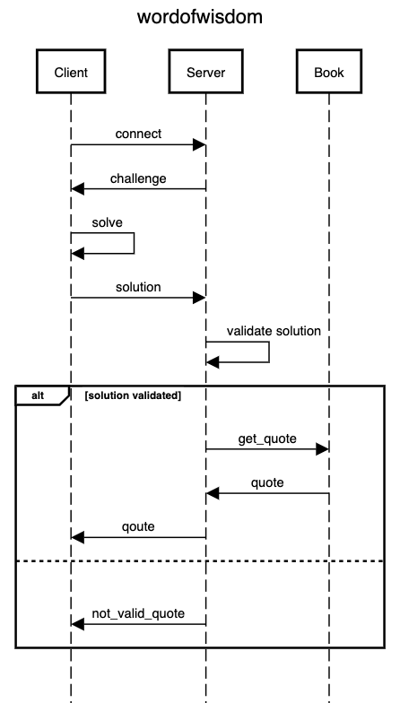

# wordofwisdom

TCP server/client to demonstrate proof of work (pow) form of cryptographic proof.
Challenge–response protocol is used. sha256 is used because it's widely used in cryptography and 
go has standard package for it.

### Run
- docker-compose:
  > docker-compose up --build
- local:
  > make server

  > make client

### Tests:
  > make tests

### Configs
- config/docker_compose.yaml - applied in docker-compose
- config/local.yaml - applied when launch locally

### Sequence Diagram

### TODO
> increase test coverage